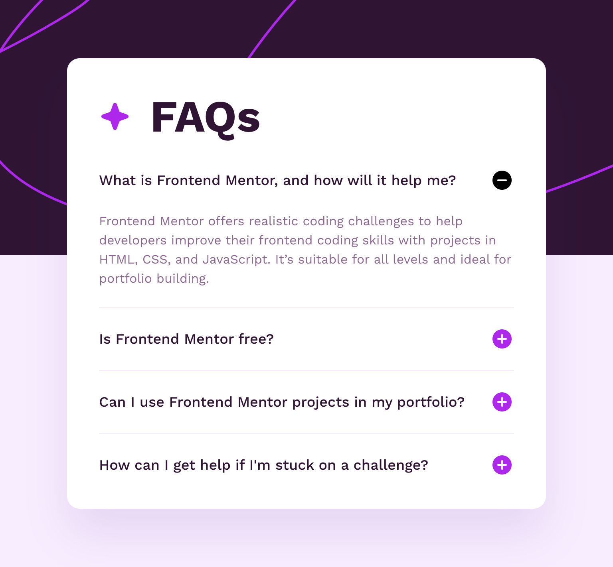
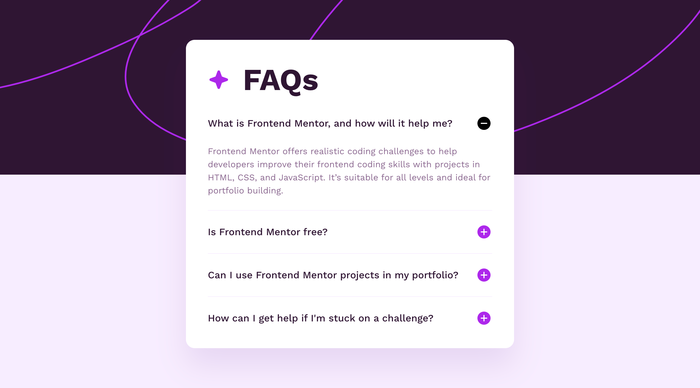

# Frontend Mentor - FAQ accordion solution

This is a solution to the [FAQ accordion challenge on Frontend Mentor](https://www.frontendmentor.io/challenges/faq-accordion-wyfFdeBwBz).

## Table of contents

- [Overview](#overview)
  - [The challenge](#the-challenge)
  - [Screenshot](#screenshot)
  - [Links](#links)
- [Built with](#built-with)
- [Author](#author)

## Overview

### The challenge

Users should be able to:

- Hide/Show the answer to a question when the question is clicked
- Navigate the questions and hide/show answers using keyboard navigation alone
- View the optimal layout for the interface depending on their device's screen size
- See hover and focus states for all interactive elements on the page

### Screenshot

| Mobile Preview                | Tablet Preview                | Desktop Preview                |
| ----------------------------- | ----------------------------- | ------------------------------ |
|  |  |  |

### Links

- Solution URL: [Frontend Mentor ↗](https://your-solution-url.com)
- Live Site URL: [Open on Vercel ↗](https://your-live-site-url.com)

### Built with

- [React](https://reactjs.org/) - JS library
- [Next.js](https://nextjs.org/) - React framework with App Router
- [TypeScript](https://www.typescriptlang.org/) - For type safety
- [Tailwind CSS](https://tailwindcss.com/) - For utility-first styling
- [Radix UI](https://www.radix-ui.com/primitives/docs/components/accordion) - For accessible accordion component
- [Vitest](https://vitest.dev/) - For unit testing
- Semantic HTML5 markup
- Mobile-first responsive design
- Proper SEO setup with metadata

## Author

- Frontend Mentor - [@ardaeker](https://www.frontendmentor.io/profile/ardaeker)
